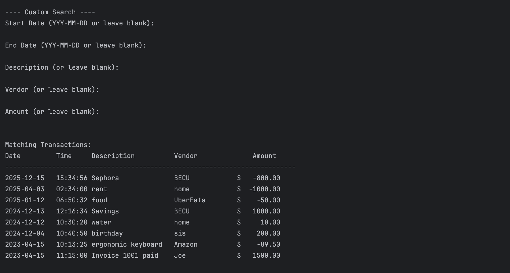

# Accounting Ledger Project  
  
## Overview  
Welcome to the Accounting Ledger App. This is a command line interface (CLI) project that is written in Java.  
  
## Screens  
This project has four screens:  
1) Home Screen  
  
2) Ledger Screen  
  
3) Report Screen
  
4) Custom Search
  
  
## Features  
* In the Home screen, Users can add deposits and make payments  
* In the Ledger screen, users can see all transactions, their deposits, their payments  
* In the Reports screen, they can see what transactions they made including transactions by month, by year, by previous year and by vendor name
* In the Custom Search Screen, users can search for transactions using any combination of filters such as start date, end date, description, vendor, and amount to find exactly the transactions they’re looking for.
  
## One interesting piece of code from my project  
One key feature is how the app filters transactions by date. Here's the logic used to show Year-to-Date transactions:

    public void showYearToDate() {
    
    LocalDate today = LocalDate.now();
    DateTimeFormatter formatter = DateTimeFormatter.ofPattern("yyyy-MM-dd");

    for (Transaction transaction : transactions) {
        LocalDate transDate = LocalDate.parse(transaction.getDate(), formatter);

        if (transDate.getYear() == today.getYear() &&
            (transDate.isBefore(today) || transDate.isEqual(today))) {
            System.out.println(transaction);
        }
      }
    }

This method:
- Gets the current date
- Loops through all transactions
- Parses each transaction’s date (converts them into a real date/formats them)
- Checks if the year matches and the transaction is not in the future 
- Prints all valid transactions for the current year up to today
